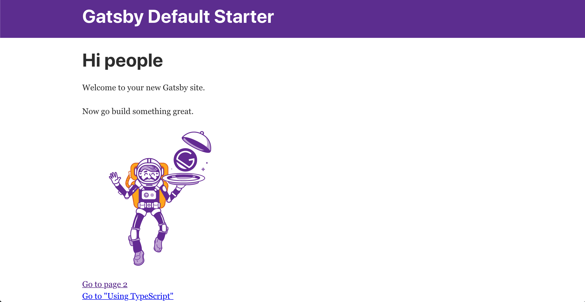
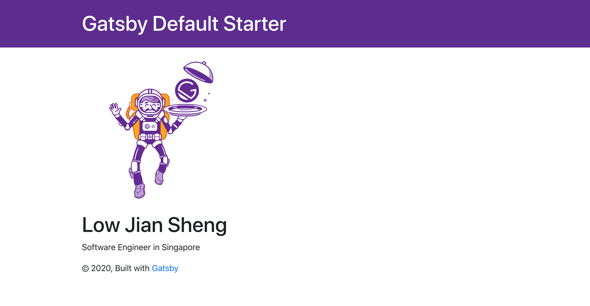
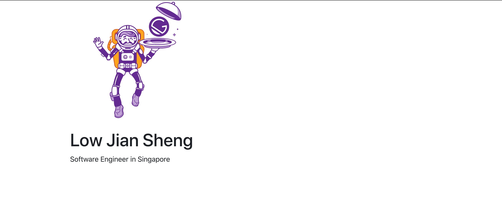
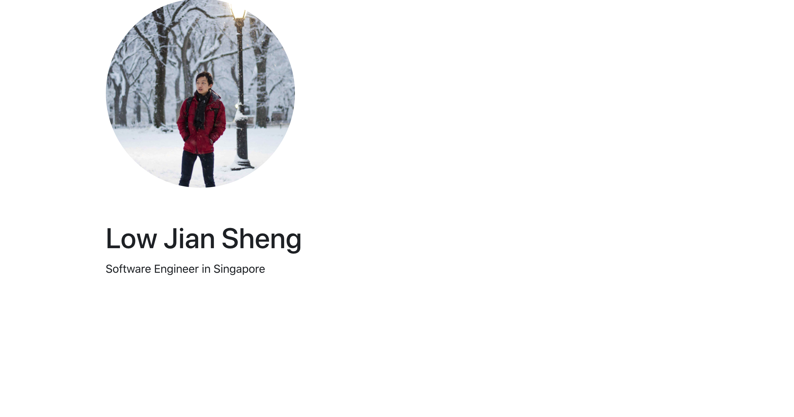
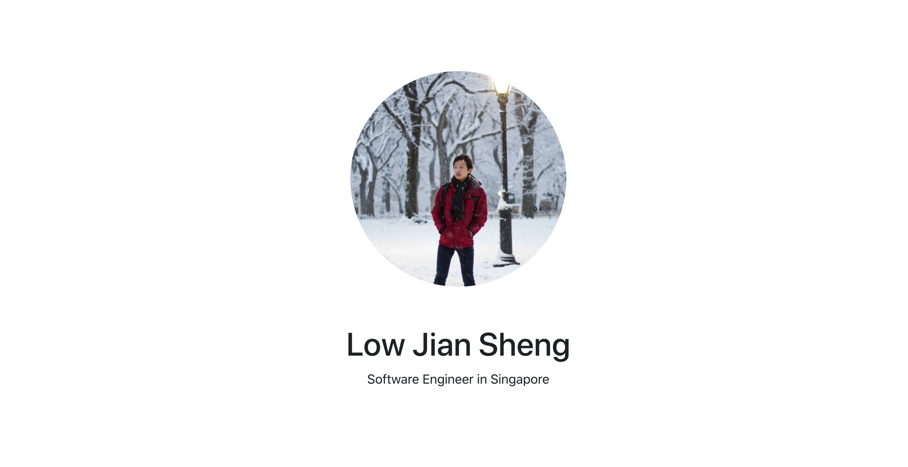

I've been thinking of developing my personal site for many months now, but have been putting that idea off due to procrastination (haven't we all). It was until I discovered Gatsby and Netlify. I realised that it actually doesn't require a lot of effort to do so.

For those of you who have not heard of Gatsby, it's basically a framework for building fast static sites using ReactJS. As compared to server rendered websites, static sites are much faster as all assets are bundled at build time and served to the client. This is the perfect setup for my use case.

## Setting up Gatsby

To install Gatsby on your computer, make sure you have npm already installed on your computer. If not, you can install it by running `brew install npm`.

Then run the command `npm install -g gatsby-cli`.

Once that's done, run `gatsby new {project-name}` and it will automatically populate all the required files.

The Gatsby folder structure is very similar to a normal react project. Most of the important `.js` files are located inside the src folder. Once the project is set up, probably the first things you'll notice are the 4 `gatsby-*` files. These are gatsby data files which contains important information which will be populated onto your site.

## Updating web configs

For our purposes, the main file to update would be `gatsby-config.js`. This file contains all the metadata for the project such as your site name. You can make the appropriate changes here that suits your site.

```jsx
module.exports = {
  siteMetadata: {
    title: `Personal Portfolio`,
    description: `Excited for my upcoming projects!`,
    author: `@lowjiansheng`,
  },...
```

In the file, you'll see another field called plugins. Gatsby allows you to add more functionalities to your side with pre-built plugins. You can find more information here in their [documentation](https://www.gatsbyjs.org/docs/plugins/). For our use case, we will not be making any modifications to this.

## Designing the page

Let's now move on to the actual design of the site.

All of your page files are located in `src/pages` folder. For our very simple portfolio page, we will not need to create more pages (unless you want to do so). For good programming practices, we can separate out our ReactJS code into smaller components which can be found in the `src/components` folder. `index.js` is the file that will be served once a user lands on your page. As you can see, the file has already been pre-populated with some code.

To see the effects of the current code, go to your terminal and run the command `gatsby develop`. It will spin up the web server and you'll be able to view the changes in localhost:8000.



And here you go! Now we'll just need to modify it a little bit to fit our use case.

I choose to use Bootstrap 4 for my layout as I am familiar with it and it supports flexbox out of the box. There are several ways to import Bootstrap into your project. The simplest would be to import the [react-bootstrap](https://react-bootstrap.github.io/) project. Simply go to the terminal and run the command `npm install react-bootstrap bootstrap`. Before any of bootstrap's code can have any effects on your site, you'll need to import the necessary .css files.

Let's also reorganise the file to display the information that we want.

`index.js`

```jsx
import React from "react"
import { Link } from "gatsby"

import Layout from "../components/layout"
import Image from "../components/image"
import SEO from "../components/seo"
import "bootstrap/dist/css/bootstrap.min.css"

const IndexPage = () => (
  <Layout>
    <SEO title="Low Jian Sheng" />
    <div style={{ maxWidth: `300px`, marginBottom: `1.45rem` }}>
      <Image />
    </div>
    <h1>Low Jian Sheng</h1>
    <p>Software Engineer in Singapore</p>
  </Layout>
)

export default IndexPage
```

I've moved the image up and put my name and title at the bottom.



This is still not close to the personal portfolio site that I envision myself having. I don't like the huge purple banner on top, the Gatsby copyright at the bottom and definitely that spaceman is not me.

If we take a look at `index.js` , we see that it's actually using the Layout component which consists of the header and footer. Let's head over to `layout.js` to remove those.

`layout.js`

```jsx
return (
    <>
      <div
        style={{
          margin: `0 auto`,
          maxWidth: 960,
          padding: `0 1.0875rem 1.45rem`,
        }}
      >
        <main>{children}</main>

      </div>
    </>
  )
}
```

In the return code, I've completely removed any traces of the header and footer. What remains is simply the body (`index.js`).



This is the cleaner and more minimalist look that I want. To change the image, we can add our image asset into the `src/images` file. Have you noticed that in Gatsby as compared to normal react projects, we don't put the asset files in the public (compiled) folder. This is one of the charms of Gatsby. To understand more about it, I'd suggest you head over to Gatsby's documentation for their explanation. The high level idea is that this allows for clearer file organisation for the developer as well as cleaner import paths.

To make my code cleaner, I've created a new component called ProfileImage. This component's responsibility is to fetch my profile image as well as render it into a round circular image. I'll be using Bootstrap's Image module to help me achieve that.

`profileImage.js`

```jsx
import React from "react"
import { useStaticQuery, graphql } from "gatsby"
import { Image } from "react-bootstrap"

const ProfileImage = () => {
  const data = useStaticQuery(graphql`
    query {
      placeholderImage: file(relativePath: { eq: "profile-picture.jpg" }) {
        childImageSharp {
          fluid(maxWidth: 400, quality: 100) {
            ...GatsbyImageSharpFluid
          }
        }
      }
    }
  `)
  return (
    <Image
      src={data.placeholderImage.childImageSharp.fluid.src}
      roundedCircle={true}
    />
  )
}

export default ProfileImage
```



The final part to do is to align the components in the page correctly. To do that, I choose to use flexbox as it offers a lot of flexibility and control. There is a very concise [cheatsheet about flexbox](https://css-tricks.com/snippets/css/a-guide-to-flexbox/) that I suggest you read about before implementing this.

```jsx
import React from "react"

import Layout from "../components/layout"
import ProfileImage from "../components/profileImage"
import SEO from "../components/seo"
import "bootstrap/dist/css/bootstrap.min.css"

const styles = {
  container: {
    height: "100vh",
  },
}

const IndexPage = () => (
  <Layout>
    <div className="container d-flex" style={styles.container}>
      <div className="col align-self-center">
        <SEO title="Low Jian Sheng" />
        <div className="row justify-content-center">
          <div style={{ maxWidth: `300px`, marginBottom: `1.45rem` }}>
            <ProfileImage />
          </div>
        </div>
        <div className="row justify-content-center">
          <h1>Low Jian Sheng</h1>
        </div>
        <div className="row justify-content-center">
          <p>Software Engineer in Singapore</p>
        </div>
      </div>
    </div>
  </Layout>
)

export default IndexPage
```



That's it! You can choose to add more information or design it to however way you'd like with simple ReactJS code. It'll be good to add some links to your social media accounts or resume here.

## Deployment

For deployment, I chose to use Netlify as it's really simple and straightforward to do so. First head over to [Netlify's website](https://www.netlify.com/) and create an account with them. There are a few ways to deploy your site, but the method I prefer is through their CLI. To install their CLI, run the command `npm install netlify-cli -g`.

Once it's installed, at the root folder of your project, run the command `netlify init`. It will prompt you for some questions. Simply go through all of them.

```bash
~/Docu/pr/portfolio-demo | master !4 ?2 ▓▒░ netlify init

No git remote was found, would you like to set one up?
```

Before deployment, at the root folder, run the command `gatsby build` to compile your source code.

Once that's done run the command `netlify deploy --prod --dir .` and your site is deployed! The site url will be provided in the response.
